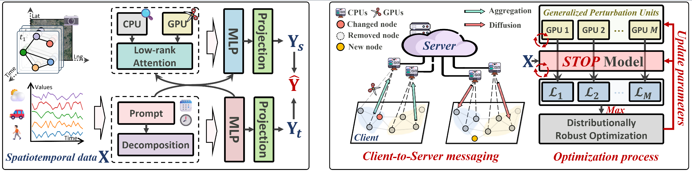

# ICLR 2025 Submission 116: STOP! A Out-of-Distribution Processor with Robust Spatiotemporal Interaction
This is the official repository of our ICLR 2025 submitted paper. Please note that our code repository only provides some of the pre-processed, directly runnable data for <b>KnowAir</b> and <b>TrafficStream</b>. The raw data for <b>LargeST</b> needs to be obtained and processed as follows, with the corresponding processing files attached in the repository. If not available, they can be obtained from the official repository of the respective dataset.



## 1. Introduction about the Datasets
### 1.1 Generating SD, GBA, GLA, CA datasets from LargeST dataset for OOD Setting
In the experiments of LargeST, we used SD, GBA, GLA and CA datasets with years from 2017 to 2021, followed by [LargeST](https://github.com/liuxu77/LargeST/blob/main). For example, you can download CA dataset from the provided [link](https://www.kaggle.com/datasets/liuxu77/largest) and please place the downloaded `archive.zip` file in the `LargeST/data/ca` folder and unzip the file. 

First of all, you should go through the jupyter notebook `process_ca_his.ipynb` in the folder `LargeST/data/ca` to process and generate a cleaned version of the flow data. Then, please go through all the cells in the provided jupyter notebooks `generate_SUBDATASET_dataset.ipynb` in the folder `LargeST/data/SUBDATASET` for `SUBDATASET=sd, gba, gla, ca`. Finally use the commands below to generate the traffic flow data of LargeST for our experiments. 
```
python LargeST/data/generate_data_for_training_ood.py --dataset SUBDATASET
```

### 1.2 Generating the TrafficStream Dataset for OOD Setting
We implement extra experiments on [TrafficStream](https://github.com/AprLie/TrafficStream). We have prepared the adjacency matrix data for you, you need to unzip the TrafficStream zip data from the provided [link](https://drive.google.com/file/d/1P5wowSaNSWBNCK3mQwESp-G2zsutXc5S/view?usp=sharing) and put all the files: `20XX.npz` in folder `district3F11T17/finaldata` into `TrafficStream/data`, then go through the jupyter notebook `generate_ts.ipynb` in the folder `TrafficStream/data` to process the data into the types needed in the STOP framework, and then run similarly to divide the OOD dataset.
```
python TrafficStream/data/generate_data_for_training_ood.py
```

### 1.3 Generating the KnowAir Dataset for OOD Setting
You need to download the `KnowAir.npy` file from the provided [link](https://drive.google.com/file/d/1R6hS5VAgjJQ_wu8i5qoLjIxY0BG7RD1L/view) and please place the downloaded `Knowair.npy` file in the `Knowair/data` folder to complete the data files.

<br>

## 2. Environmental Requirments
The experiment requires the same environment as [LargeST](https://github.com/liuxu77/LargeST/blob/main), and need to add the libraries mentioned in the requirements in [Knowair](https://github.com/shuowang-ai/PM2.5-GNN).

<br>

## 3. Model Running
To run STOP on <b>LargeST</b>, for example, you may enter the folder `LargeST` and directly execute the Python file in the terminal:
```
python experiments/stop/main.py --device cuda:0 --dataset SUBDATASET --checkyears YEARS
```
for `SUBDATASET=sd, gba, gla, ca` and `YEARS=2017, 2018, 2019, 2020, 2021`. 
To run STOP on <b>Knowair</b> or <b>TrafficStream</b>, you may enter the corresponding folder and directly execute the Python file in the terminal:
```
python experiments/stop/main.py --device cuda:0
```

## 4. DIY OOD Parameters As You Want!
`--max_increase_ratio` is the maximum proportion of nodes that can be added to the test set also determines the number of nodes used in the training set.<br>
`--test_increase_ratio` is the proportion of existing nodes to be removed from the test set.<br>
`--test_decrease_ratio` is the proportion of new nodes to be added to the test set relative to the training set.<br>
`--checkyears` controls the years of data in test.<br>
